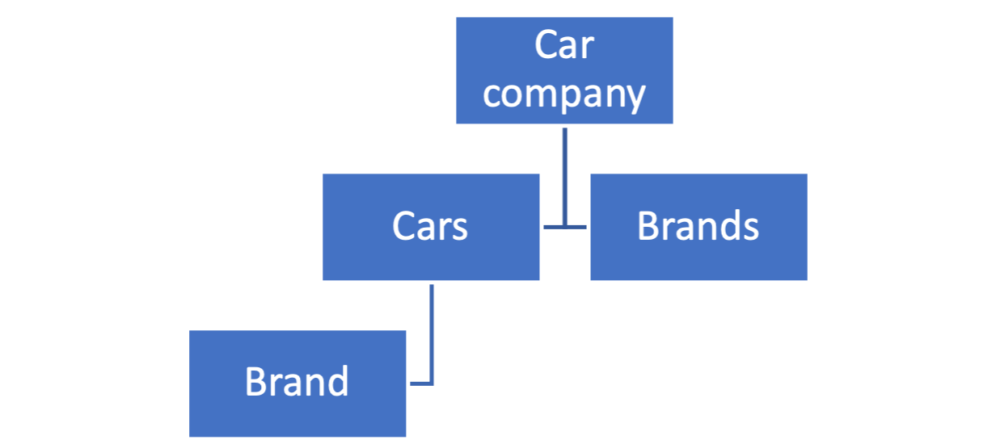

# Exercise

A little exercise on configuration and CRUD actions with MicroStream

You need to model and implement endpoints that can manage data for a _Car Company_.  You have the entities `Car` and `Brand` and you need to design the datamodel.

A possible solution could be

The endpoints that are required are:

-	…/car/list
-	…/car/get
-	…/car/delete
-	…/car/insert
-	…/brand/list
-	…/brand/insert
-	…/brand/update

Additional task: Use properties or XML file configuration.
