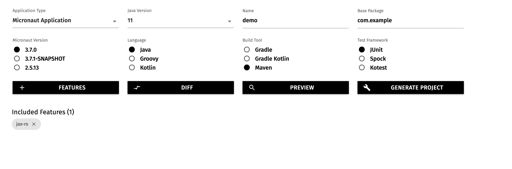
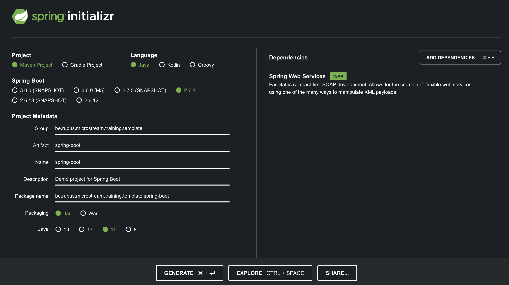
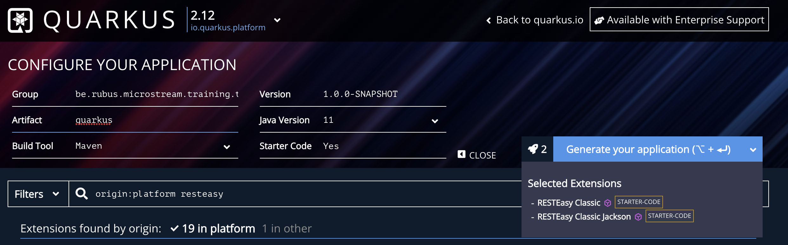

# Runtime templates for the Training

For some exercises in the training, it helps to make use of a runtime that supports REST endpoints so that some features can be seen in action in a more realistic way.

There are several templates available that allows the attendees to choose the runtime they are most familiar with.

Each template has Endpoints enabled with the use of JSON payloads. Within the `DB` class, a Storage manager is created with some data to get you started.

Remark: There are better ways of instantiating and accessing the `StorageManager` and _Root_ object in those runtimes through the integrations that are available.  But the idea is to keep it as simple as possible so that we can concentrate on the topics of the training.

## Templates

- Micronaut
- Payara Micro
- Spring Boot
- Quarkus

## Micronaut

Created the template through [Micronaut launch](https://micronaut.io/launch/), selected Java 11, Maven and JAX-RS as feature.

- `mvn clean package`
- `java -jar target/micronaut-0.1.jar`
- `curl localhost:8080/products`

## Payara Micro

Created the template through [MicroProfile Start](https://start.microprofile.io/), selected MicroProfile 4.0, Java 11 , and Maven. No need to select any of the MicroProfile specifications.

- `mvn clean package`
- `java -jar target/demo-microbundle.jar`
- `curl localhost:8080/products`

## Spring Boot

Created the template through [Spring Initialzr](https://start.spring.io/), selecting a Java project build by Maven using Java 11 and as dependency added the _Spring Web Services_

- `mvn clean package`
- `java -jar target/spring-boot-0.0.1-SNAPSHOT.jar`
- `curl localhost:8080/products`

## Quarkus

Created the template through [Quarkus Code](https://code.quarkus.io/), selecting a Java 11, Maven and 2 dependencies,  _RestEasy classic_ and _RestEasy classic Jackson_.

- `mvn clean quarkus:dev`
- `curl localhost:8080/hello/products`
